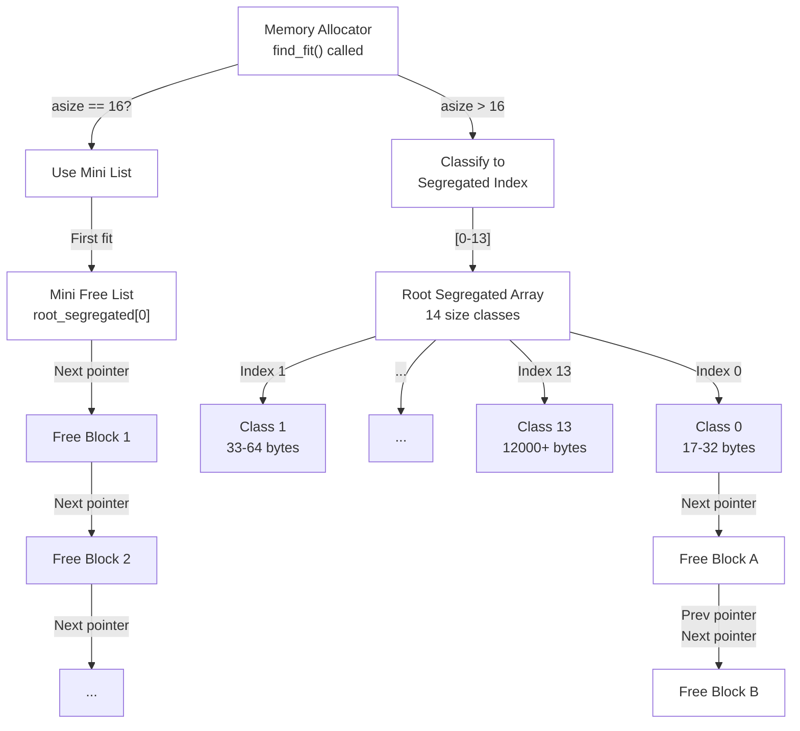
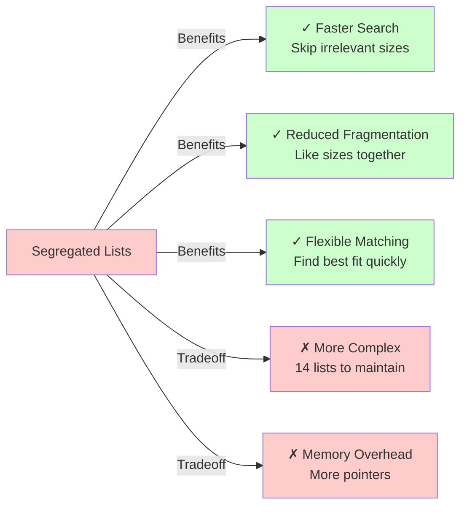
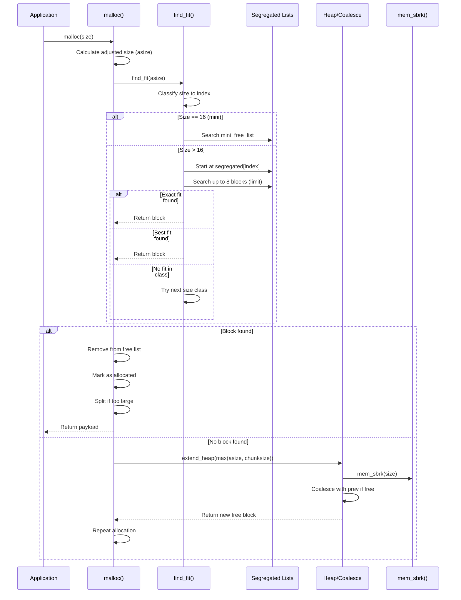
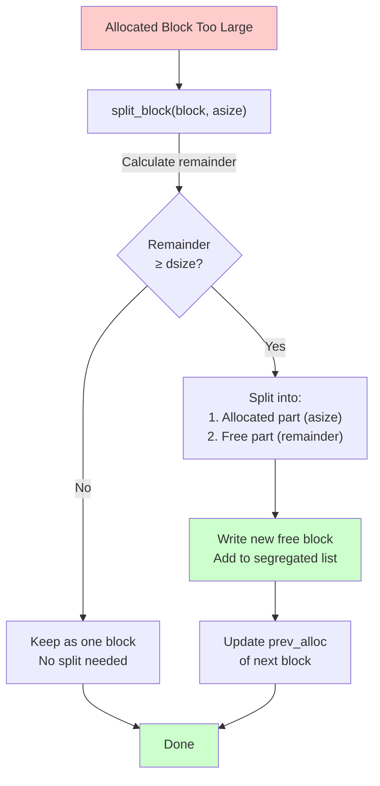

# Memory Allocator Overview

## Executive Summary

This is a **64-bit segregated free list memory allocator** implementing a sophisticated dynamic memory management system for the CMU 15-503 (Introduction to Computer Systems) course. The allocator combines implicit heap bookkeeping, segregated size classes, and optimized handling of small ("mini") blocks to achieve both memory efficiency and good throughput performance.

**Key Author**: Shrey Parekh (shreypar@andrew.cmu.edu)

---

## What This Allocator Does

The memory allocator provides a complete implementation of `malloc()`, `free()`, `realloc()`, and `calloc()` functions that:

1. **Manages dynamic memory allocation** from a linear heap using `sbrk()` system calls
2. **Tracks block metadata** with headers and footers containing size and allocation status
3. **Segregates free blocks** into 14 size classes plus a special mini block list
4. **Optimizes for small allocations** using a dedicated list for 16-byte "mini" blocks
5. **Coalesces fragmented free blocks** to reduce external fragmentation
6. **Validates heap consistency** with comprehensive heap checking functions
7. **Supports 64-bit address spaces** with sparse memory emulation

The allocator trades off between:
- **Memory utilization** (minimizing fragmentation and metadata overhead)
- **Throughput** (allocation/deallocation speed)
- **Implementation complexity** (segregated lists with careful bookkeeping)

## Segregated List Approach

### Overview Diagram


Size Classification
The allocator uses 14 size classes to segregate free blocks:

```
Index │ Size Range        │ Max Bucket Size │ Purpose
──────┼───────────────────┼─────────────────┼──────────────────────────
  0   │ ≤ 16 bytes        │ 16              │ Mini blocks (special handling)
  1   │ 17-32 bytes       │ 32              │ Small pointers/structs
  2   │ 33-64 bytes       │ 64              │ Medium small objects
  3   │ 65-128 bytes      │ 128             │ Larger small objects
  4   │ 129-256 bytes     │ 256             │ Medium objects
  5   │ 257-512 bytes     │ 512             │ Medium-large objects
  6   │ 513-1024 bytes    │ 1024            │ Large objects
  7   │ 1025-1600 bytes   │ 1600            │ Very large objects
  8   │ 1601-2048 bytes   │ 2048            │ Page-size objects
  9   │ 2049-3000 bytes   │ 3000            │ Multi-page objects
  10  │ 3001-4096 bytes   │ 4096            │ Small memory pages
  11  │ 4097-8192 bytes   │ 8192            │ Large memory pages
  12  │ 8193-12000 bytes  │ 12000           │ Very large pages
  13  │ > 12000 bytes     │ ∞               │ Huge allocations

```
Mini blocks: exactly dsize (16 bytes)
Structure: [Header (8 bytes)] [Mini_next pointer (8 bytes)]
No footer needed - size is implicit
Use case: Very common allocation size (pointers, struct headers)

```
Mini Free List (Singly-Linked):
┌──────────┐     ┌──────────┐     ┌──────────┐
│ Block 1  │────→│ Block 2  │────→│ Block 3  │───→ NULL
│ Header   │     │ Header   │     │ Header   │
│ mini_next│     │ mini_next│     │ mini_next│
└──────────┘     └──────────┘     └──────────┘
```
Benefits:
- Constant-time removal from mini free list
- Single pointer instead of prev/next pair
- Saves 8 bytes per mini block's metadata



Mini blocks: exactly dsize (16 bytes)
Structure: [Header (8 bytes)] [Mini_next pointer (8 bytes)]
No footer needed - size is implicit
Use case: Very common allocation size (pointers, struct headers)

```

Mini Free List (Singly-Linked):
┌──────────┐     ┌──────────┐     ┌──────────┐
│ Block 1  │────→│ Block 2  │────→│ Block 3  │───→ NULL
│ Header   │     │ Header   │     │ Header   │
│ mini_next│     │ mini_next│     │ mini_next│
└──────────┘     └──────────┘     └──────────┘

```
Benefits:
- Constant-time removal from mini free list
- Single pointer instead of prev/next pair
- Saves 8 bytes per mini block's metadata





## Why this matters
```
Before split:
┌──────────────────────────┐
│ Allocated (used: 32B)    │  (40 bytes total)
│ Wasted space (8 bytes)   │
└──────────────────────────┘

After split:
┌──────────────────────────┐
│ Allocated (used: 32B)    │  (40 bytes for malloc)
└──────────────────────────┘
┌──────────────┐
│ Free (8B)    │  (available for reuse)
└──────────────┘
```
